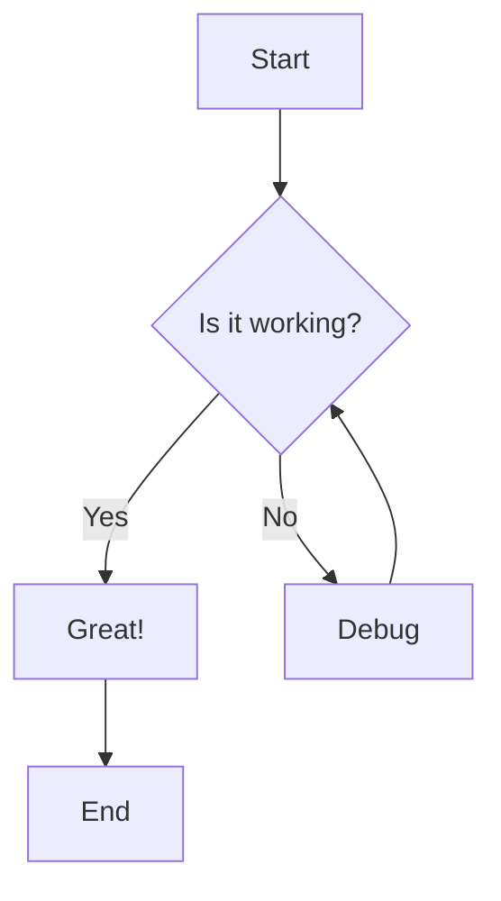
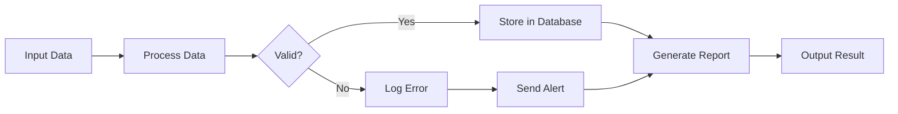
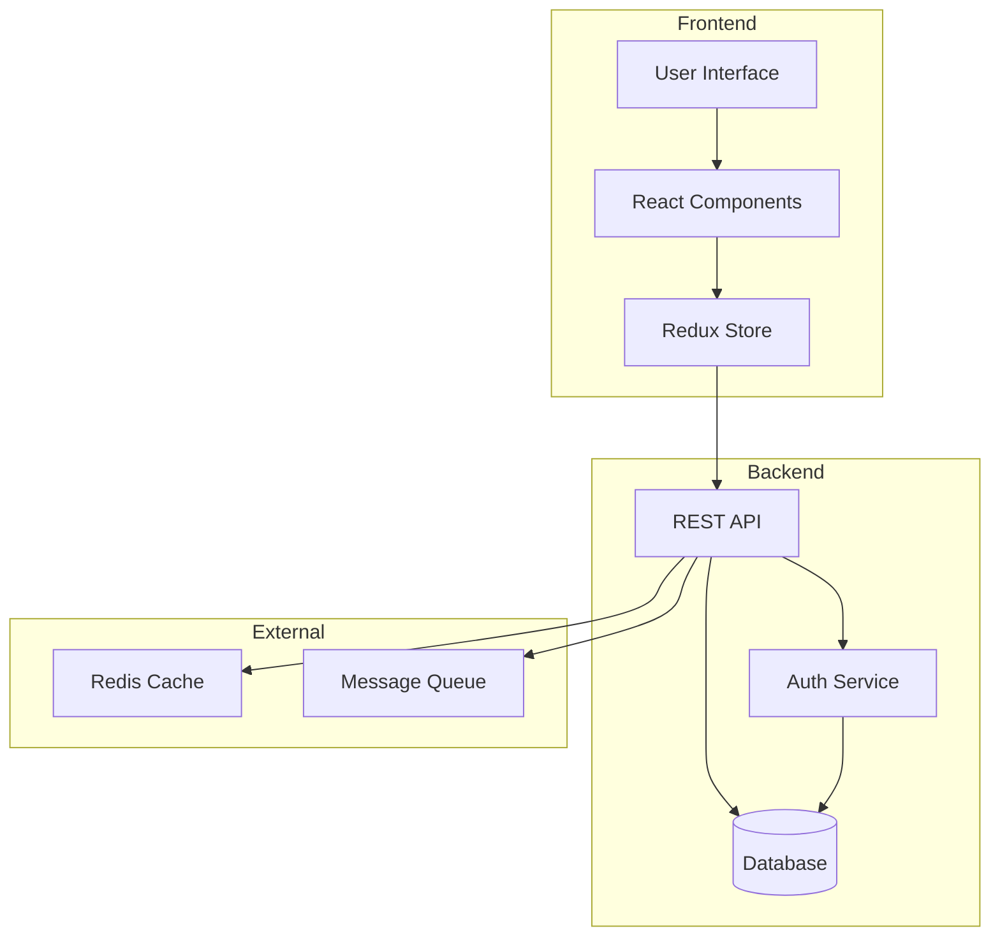
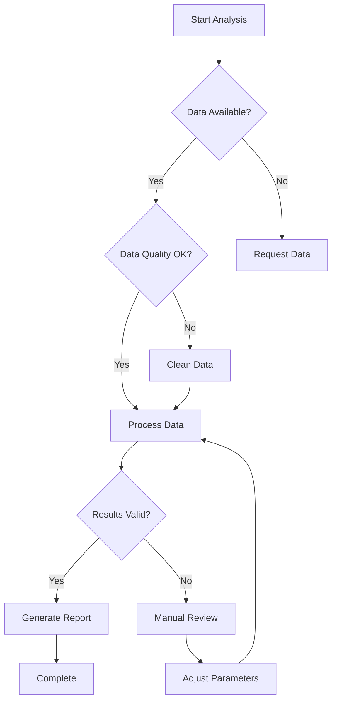
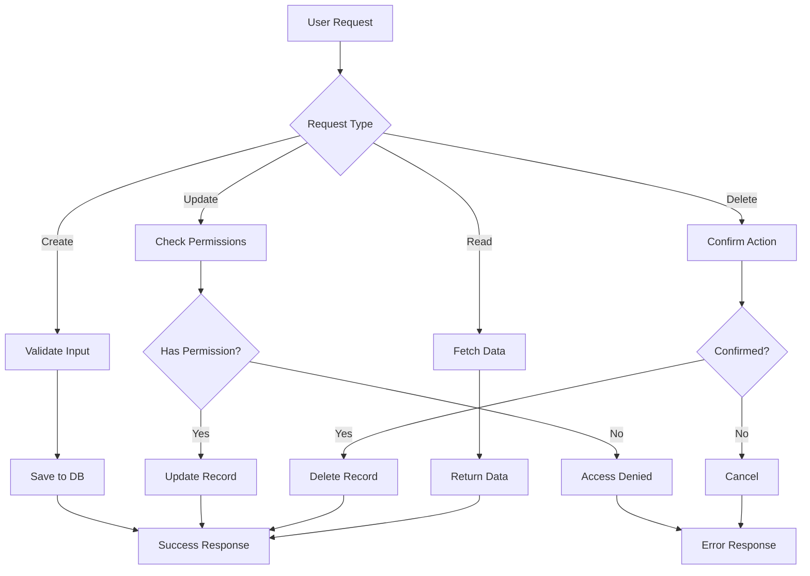
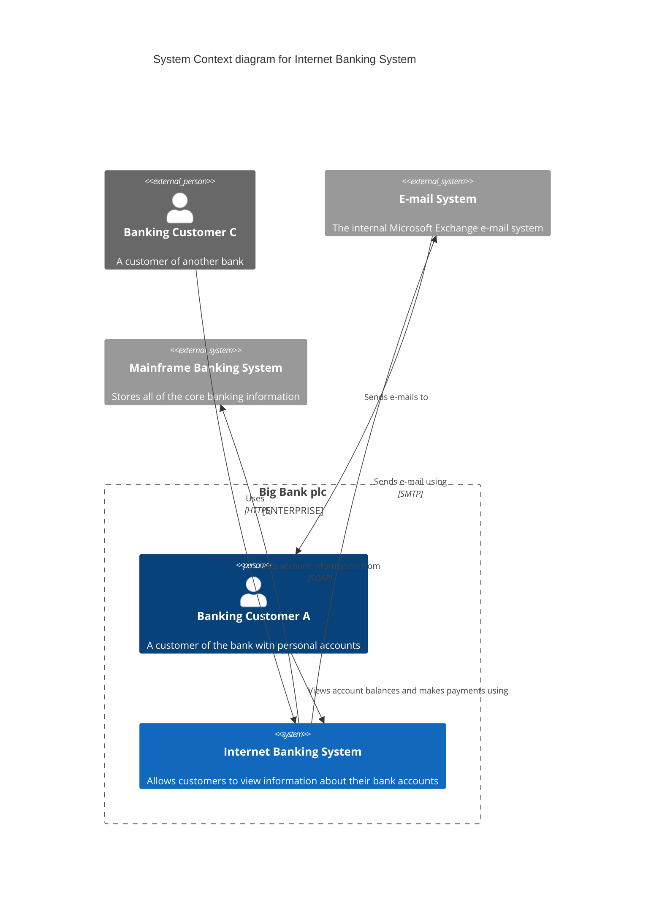
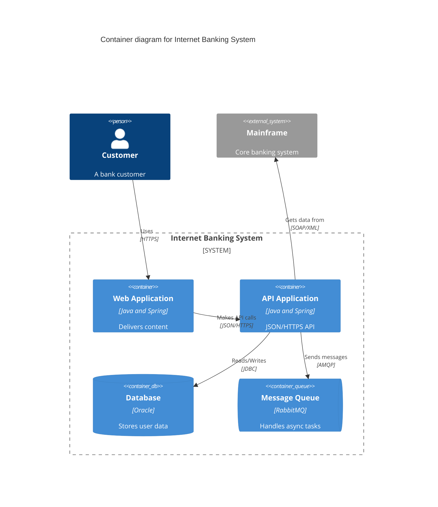

# Example Mermaid Diagrams

This file contains several Mermaid diagrams that can be visualized using the Mermaid to React Flow converter.

## Simple Flowchart

## Process Flow with Styling

## Complex System Architecture

## Decision Tree

## Workflow with Multiple Paths

## C4 Context Diagram

## C4 Container Diagram Example

